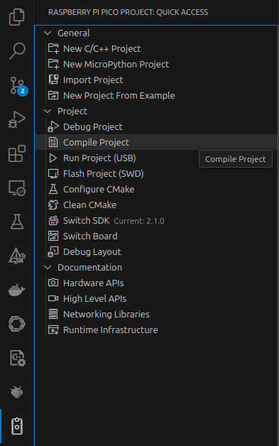

# TOPPERS/ASP3×pico-sdk

[TOPPERS/ASP3](https://github.com/exshonda/asp3_pico_sdk)を[pico-sdk](https://github.com/raspberrypi/pico-sdk)と使えるようにしたプロジェクトの例です。

[Visual Studio Code](https://code.visualstudio.com/)の[Raspberry Pi Pico 拡張機能](https://github.com/raspberrypi/pico-vscode)で作成したプロジェクトに、`asp3`を追加することで、シングルコア対応 RTOS API が使えます。

Raspberry Pi Pico 2（RP2350）の **ARM（Cortex-M33）／RISC-V（Hazard3）の両方**で使えます。
ターゲットは Pico 拡張機能の「ボード切り替え」で切り替えられます（後述）。

## リポジトリのクローン

純カーネル（`asp3/asp3_core`）はサブモジュールなので、下記のように再帰的にクローンしてください。

```bash
git clone --recurse-submodules https://github.com/exshonda/asp3_pico_sdk.git
cd asp3_pico_sdk
# 既にクローン済みの場合: git submodule update --init --recursive
```

## ビルド方法（VS Code）

VS Code でサンプルのフォルダ `sample1` を開き、Pico 拡張機能のビルド機能をそのまま使用します。
（拡張機能が `CMakeLists.txt` 冒頭のブロックを認識して、SDK・ツールチェーン・ビルド設定を自動構成します。）

1. VS Code で **`sample1` フォルダ**を開く（リポジトリのルートではなく `sample1`）。
2. ステータスバー下部の **Compile**（または Run）ボタンでビルド／書き込みを行う。
3. デバッグは同梱の `sample1/.vscode/launch.json`（Cortex-Debug）で行えます（SWD デバッガ接続時）。



> 生成物は `sample1/build/`（拡張機能の既定）に出力され、`*.uf2` を `RPI-RP2` にコピーするか拡張機能の Run で書き込みます。

### ターゲット（ARM ↔ RISC-V）の切り替え

ソースコードや `CMakeLists.txt` は ISA 非依存で、**ターゲットの切り替えは Pico 拡張機能の操作だけ**で行えます。

1. コマンドパレット（`Ctrl/Cmd + Shift + P`）→ **「Raspberry Pi Pico: Switch Board」** を実行
   （ステータスバーのボード表示からも切り替え可）。
2. ボード `pico2` を選び、**アーキテクチャを ARM か RISC-V から選択**する。
   - RISC-V を初めて選ぶ場合、拡張機能が **RISC-V 用ツールチェーンの導入を促す**ので、導入してください
     （ARM 用とは別の `riscv32-unknown-elf`／newlib ベースのツールチェーンが使われます）。
3. 切り替えると拡張機能が再コンフィグし、選んだ ISA でビルドできます。

仕組み：拡張機能は `sample1/CMakeLists.txt` 冒頭ブロックの `set(toolchainVersion ...)` を
ARM 用（例 `14_2_Rel1`）と RISC-V 用（例 `RISCV_RPI_2_0_0_5`）で書き換えます。これに連動して
`PICO_PLATFORM`（`rp2350-arm-s` ↔ `rp2350-riscv`）と使用ツールチェーンが切り替わります。

> RISC-V ではシリアル受信割込みを ASP3 側で受けるなど ISA 固有の調整が入りますが、いずれも
> リポジトリ内（`asp3_pico_sdk.cmake`・`asp3/target/...`）で吸収済みで、利用者の操作は上記の切り替えのみです。

### コマンドラインでのビルド（任意）

VS Code を使わずにビルドする場合は、**ISA ごとに別のビルドディレクトリ**を指定し、`PICO_PLATFORM` を渡します
（同一ビルドディレクトリでは ISA を切り替えられません＝CMake キャッシュにツールチェーンが固定されるため）。

```bash
export PICO_SDK_PATH=/path/to/pico-sdk          # 2.1.1 / 2.2.0 で確認済
cd sample1

# ARM（Cortex-M33）
cmake -S . -B build_arm   -DPICO_PLATFORM=rp2350-arm-s -DPICO_BOARD=pico2 && cmake --build build_arm -j

# RISC-V（Hazard3）※拡張機能の RISC-V ツールチェーンが PATH / PICO_TOOLCHAIN_PATH にある前提
cmake -S . -B build_riscv -DPICO_PLATFORM=rp2350-riscv -DPICO_BOARD=pico2 && cmake --build build_riscv -j
```

## 新規プロジェクトへの適用方法

Pico 拡張機能で作成したプロジェクトに TOPPERS/ASP3 を追加できます。
サンプル [`sample1/CMakeLists.txt`](sample1/CMakeLists.txt) を参照しながら、要点を説明します。

本リポジトリの構成：

```
asp3_pico_sdk/
├── asp3_pico_sdk.cmake      ← pico-sdk 協調ヘルパ
├── asp3/asp3_core/          ← submodule（純カーネル）
└── sample1/CMakeLists.txt   ← アプリ
```

プロジェクトの `CMakeLists.txt` で、`pico_sdk_init()` の後に以下を追加します。

### 1. 協調ヘルパのインクルード

`asp3_pico_sdk.cmake` を include します。`PICO_PLATFORM` から `ASP3_TARGET`／`ASP3_TARGET_DIR`、
および純カーネルのパス `ASP3_CORE_DIR` などが解決されます。

```cmake
# 配置に応じてパスを調整（本リポジトリでは sample1 の 1 つ上の階層）
include(../asp3_pico_sdk.cmake)
```

### 2. アプリ（タスク定義の cfg）の指定

タスクやセマフォを静的 API で定義した cfg を、アプリのフォルダとアプリ名で指定します
（cfg は `${ASP3_APPLDIR}/${ASP3_APPLNAME}.cfg` が使われます）。

```cmake
set(ASP3_APPLDIR  ${ASP3_CORE_DIR}/sample)  # 自作アプリのフォルダに変更可
set(ASP3_APPLNAME sample1)                  # → sample1.cfg
```

### 3. asp3 をライブラリとして追加

ライブラリ専用モード（`ASP3_LIBRARY_ONLY`）で純カーネルを `add_subdirectory` します
（`asp` 実行ファイルやテストは作らず、`asp3` ライブラリ・cfg 生成・ヘルパ関数のみが公開されます）。

```cmake
set(ASP3_LIBRARY_ONLY ON CACHE BOOL "build asp3 as library only" FORCE)
add_subdirectory(${ASP3_CORE_DIR} asp3)   # 第2引数はビルド出力フォルダ名
```

### 4. 実行ファイルとシステムサービス

アプリ本体（タスク定義）と `main()` を持つソースから実行ファイルを作り、システムサービスを追加します。

```cmake
add_executable(my_app
    ${ASP3_CORE_DIR}/sample/sample1.c   # タスク本体（自作に置換）
    my_app.c                            # main() を持つ pico ラッパ
)
asp3_add_syssvc(my_app)   # syslog/banner/serial/logtask＋library をまとめて追加
```

### 5. ライブラリのリンクと pico-sdk 設定

```cmake
target_link_libraries(my_app pico_stdlib asp3)

# irq_* の --wrap・ランタイム初期化抑止など（ASP3 が割込みを掌握するための設定）
asp3_set_pico_sdk_options(my_app)
```

`asp3_set_pico_sdk_options()` は `PICO_PLATFORM` を見て **ARM／RISC-V を自動で切り替えます**
（割込みを ASP3 へ誘導する方法が ISA で異なるため）。利用者は ISA を意識する必要はありません。
